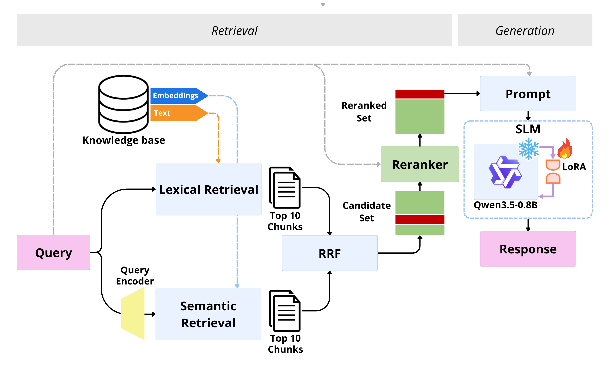

# FarmifAI — Offline AI for Agriculture

**FarmifAI** is an Android application for **offline agricultural decision support in Colombia**. It combines a domain-adapted Small Language Model (SLM) with a local Retrieval-Augmented Generation (RAG) pipeline to retrieve technical agricultural information and generate responses directly on the mobile device.

The project was developed at the **Universidad del Cauca** in the context of research on the use of Small Language Models for agricultural decision support in environments with limited or unstable Internet connectivity.

---

## Features

- Offline agricultural chat using an SLM + RAG.
- Hybrid lexical and semantic retrieval.
- Local GGUF inference with `llama.cpp`.
- Semantic retrieval and reranking with ONNX Runtime.
- Source citations for retrieved information.
- Plant disease classification with MindSpore Lite.
- Offline speech recognition with Vosk.
- Android Text-to-Speech.
- Local operation after the required models have been provisioned.

---

## APK

### Latest release

[Download or view the latest FarmifAI release](https://github.com/Bryan-Andres-Suarez-Sanchez/FarmifAI/releases/latest)

### Currently published APK

[Download the currently published signed APK](https://github.com/Bryan-Andres-Suarez-Sanchez/FarmifAI/releases/download/apk-final-signed-20260420/FarmifAI-release-v1.0-20260420_182313-signed.apk)

> The repository may contain newer code than the currently published APK. A new APK containing the latest RAG architecture will be published in a future release.

---

## RAG Architecture



The current RAG pipeline follows these stages:

1. **BM25 lexical retrieval** — Top-10 chunks.
2. **Semantic retrieval** using `intfloat/multilingual-e5-small` — Top-10 chunks.
3. **Reciprocal Rank Fusion (RRF)** with `k = 60`.
4. **Cross-encoder reranking** using `cross-encoder/mmarco-mMiniLMv2-L12-H384-v1`.
5. Selection of the **Top-3** chunks.
6. Construction of the context provided to the local SLM.
7. Local answer generation using FarmifAI.

### Current RAG configuration

| Component | Configuration |
|---|---|
| Lexical retrieval | BM25Okapi |
| Lexical Top-K | 10 |
| Semantic model | `intfloat/multilingual-e5-small` |
| Embedding dimension | 384 |
| Semantic Top-K | 10 |
| Fusion | Reciprocal Rank Fusion |
| RRF `k` | 60 |
| Reranker | `cross-encoder/mmarco-mMiniLMv2-L12-H384-v1` |
| Final context | Top-3 chunks |
| Generator | FarmifAI 1.3 |
| Base model | Qwen3.5-0.8B |
| Quantization | Q5_K_M |
| Runtime | llama.cpp |

---

## Knowledge Base

The current Android knowledge base is stored at:

```text
app/src/main/assets/knowledge_base/knowledge_base.json
```

Its precomputed semantic embeddings are stored at:

```text
app/src/main/assets/knowledge_base/embeddings_chunks_e5_small.npy
```

The current deployment contains **7,606 knowledge chunks** with 384-dimensional `float32` embeddings generated using `multilingual-e5-small`.

Each chunk also contains bibliographic metadata such as its citation and publication date. Retrieved citations are normalized and deduplicated before being displayed to the user.

---

## Language Model

The current default model is:

**[FarmifAI/FarmifAI_1.3_GGUF](https://huggingface.co/FarmifAI/FarmifAI_1.3_GGUF)**

| Property | Value |
|---|---|
| Base model | Qwen3.5-0.8B |
| Fine-tuned model | FarmifAI 1.3 |
| Format | GGUF |
| Quantization | Q5_K_M |
| Approximate size | 593 MB |
| Runtime | llama.cpp |
| Execution | On-device |

The Q5_K_M quantization is used as the default mobile model to balance model quality, storage requirements, memory consumption, and inference performance.

---

## Research Background

The research behind FarmifAI included the construction of an agricultural corpus from Colombian technical documentation, generation of domain-specific instruction data, fine-tuning of a Small Language Model, and development of an offline RAG system for Android.

The research workflow processed **229 technical agricultural documents** and produced a fine-tuning dataset containing **8,767 instruction-response records**.

The fine-tuning dataset and the current RAG knowledge base are different artifacts:

- **8,767 records** → SLM fine-tuning dataset.
- **7,606 chunks** → current retrieval knowledge base used by the Android application.

---

## Offline Operation

FarmifAI is designed for scenarios where continuous Internet connectivity cannot be assumed.

An Internet connection is currently required during the **initial model provisioning**. Once the required models are available on the device, the main pipeline operates locally:

- BM25 retrieval.
- Semantic retrieval.
- RRF fusion.
- Cross-encoder reranking.
- SLM inference.

No cloud AI service is required for normal inference after setup.

---

## Additional Components

### Plant diagnosis

Plant disease classification is performed locally using **MindSpore Lite** and CameraX.

### Voice interaction

- **Speech-to-Text:** Vosk Spanish offline model.
- **Text-to-Speech:** Android TextToSpeech.

These components operate independently from the text RAG ranking pipeline.

---

## Installation

1. Download the APK from the [latest release](https://github.com/Bryan-Andres-Suarez-Sanchez/FarmifAI/releases/latest).
2. Install it on an Android device.
3. Open FarmifAI with an Internet connection available for the initial model setup.
4. Wait until the required models are downloaded.
5. After provisioning, the main AI functionality can be used offline.

---

## Developer Setup

### Requirements

- Android Studio
- Android SDK 35
- Android NDK `27.2.12479018`
- CMake `3.22.1`
- ARM64 Android device (`arm64-v8a`)

### Build

Windows:

```powershell
.\gradlew.bat :app:testDebugUnitTest
.\gradlew.bat :app:assembleDebug
```

Install directly on a connected device:

```powershell
adb devices
.\gradlew.bat installDebug
```

Linux/macOS:

```bash
./gradlew :app:testDebugUnitTest
./gradlew :app:assembleDebug
```

---

## Limitations

- FarmifAI is a decision-support tool and is not a substitute for professional agronomic advice.
- Retrieval quality depends on the coverage and quality of the local knowledge base.
- The SLM may still generate incorrect or unsupported information.
- Initial model provisioning requires Internet access.
- Mobile inference performance depends on the hardware and thermal characteristics of the device.
- The current Android build targets `arm64-v8a`.

---

## Technologies

- Kotlin
- Jetpack Compose
- Qwen3.5
- GGUF
- llama.cpp
- ONNX Runtime
- multilingual E5
- mMARCO Cross-Encoder
- MindSpore Lite
- Vosk
- CameraX

---

## License

Pending.

---

## Acknowledgments

FarmifAI was developed at the **Universidad del Cauca**, Faculty of Electronic Engineering and Telecommunications, as part of research on Small Language Models and offline agricultural decision-support systems.

The project builds upon open-source technologies and models including Qwen, llama.cpp, Sentence Transformers, ONNX Runtime, MindSpore Lite, and Vosk.

---

**FarmifAI — agricultural AI designed to work where connectivity cannot be guaranteed.**
